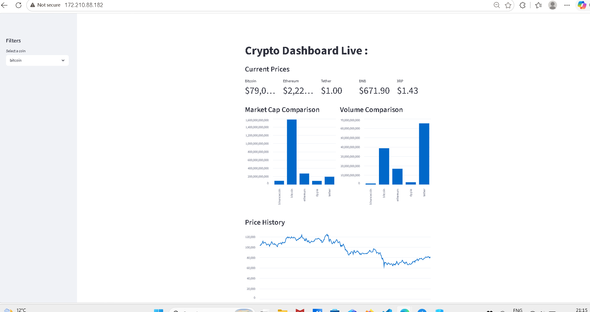
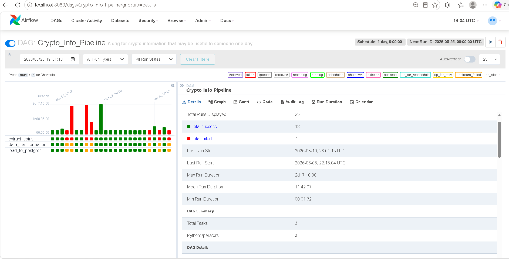
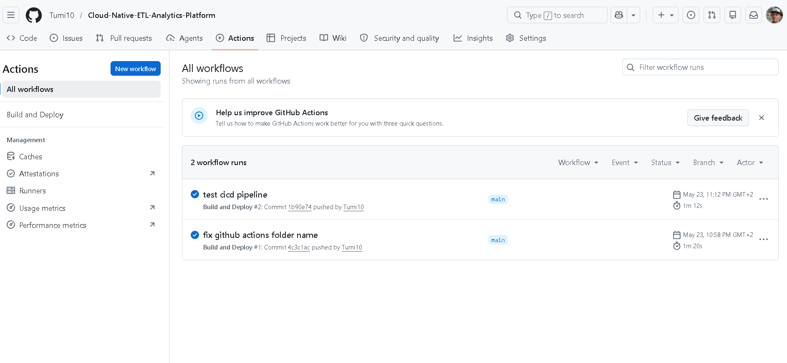
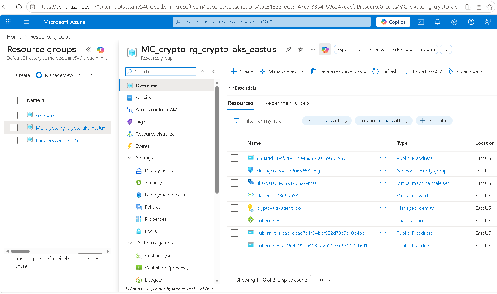

# Crypto ETL Pipeline

A production grade end to end data engineering project that extracts 
cryptocurrency data from the CoinGecko API, transforms it into a star 
schema data warehouse, and serves it through a live analytics dashboard.

## Live Dashboard
http://172.210.88.182

## Architecture

CoinGecko API → Airflow ETL → PostgreSQL Warehouse → FastAPI → Streamlit Dashboard

## Tech Stack

- **Orchestration** — Apache Airflow (DAG scheduled daily)
- **Data Warehouse** — PostgreSQL with Star Schema (FactMarket, DimCoin, DimDate)
- **API** — FastAPI with REST endpoints
- **Dashboard** — Streamlit with interactive charts
- **Containerisation** — Docker
- **Cloud** — Microsoft Azure (AKS, Container Registry, PostgreSQL)
- **Infrastructure** — Terraform
- **CI/CD** — GitHub Actions (auto deploys on push to main)

## Dashboard Preview



## Airflow Pipeline



## GitHub Actions Workflow 



## Azure Portal 




## Pipeline Overview

The pipeline runs daily and consists of three tasks:

**Extract** — Fetches top 5 cryptocurrencies by market cap from CoinGecko API 
and saves raw JSON to disk.

**Transform** — Reads JSON files and builds a star schema with three tables:
- DimCoin — static coin metadata
- DimDate — date dimension with day, month, quarter, year
- FactMarket — daily price, market cap and volume measurements

**Load** — Pushes transformed data into Azure PostgreSQL with upsert logic 
to handle duplicate runs safely.

## Star Schema
DimCoin          FactMarket          DimDate

coin_id (PK) <-- coin_id (FK)        date_id (PK)
name             date_id (FK) -----> date
symbol           price_usd           day
category         market_cap_usd      month
genesis_date     total_volume_usd    quarter
platform                             year

## API Endpoints

| Endpoint | Description |
|----------|-------------|
| GET /coins | List all coins |
| GET /coins/{coin_id} | Coin details |
| GET /coins/{coin_id}/prices | Full price history |
| GET /coins/{coin_id}/prices/latest | Latest price |
| GET /analytics/summary | All coins latest data |
| GET /analytics/top-by-volume | Ranked by volume |
| GET /analytics/top-by-marketcap | Ranked by market cap |
| GET /analytics/price-range/{coin_id} | Min, max, avg price |

## Infrastructure

All cloud infrastructure is provisioned with Terraform:
- Azure Kubernetes Service (AKS) — runs containers
- Azure Container Registry — stores Docker images
- Azure PostgreSQL Flexible Server — data warehouse
- Resource Group — organises all resources

## CI/CD

Every push to the main branch automatically:
1. Builds Docker images for FastAPI and Streamlit
2. Pushes images to Azure Container Registry
3. Deploys updated containers to AKS cluster

## How to Run Locally

```bash
# start infrastructure
docker-compose up -d

# start API
cd "backend API"
uvicorn api:app --reload --port 8000

# start dashboard
streamlit run dashboard.py
```